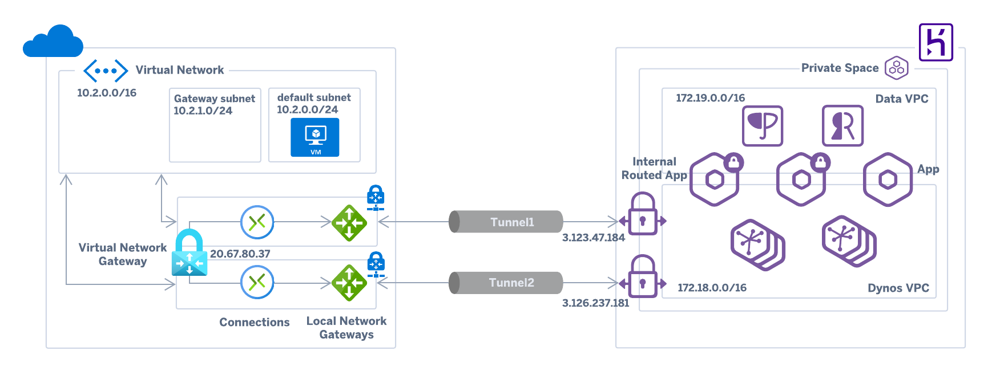
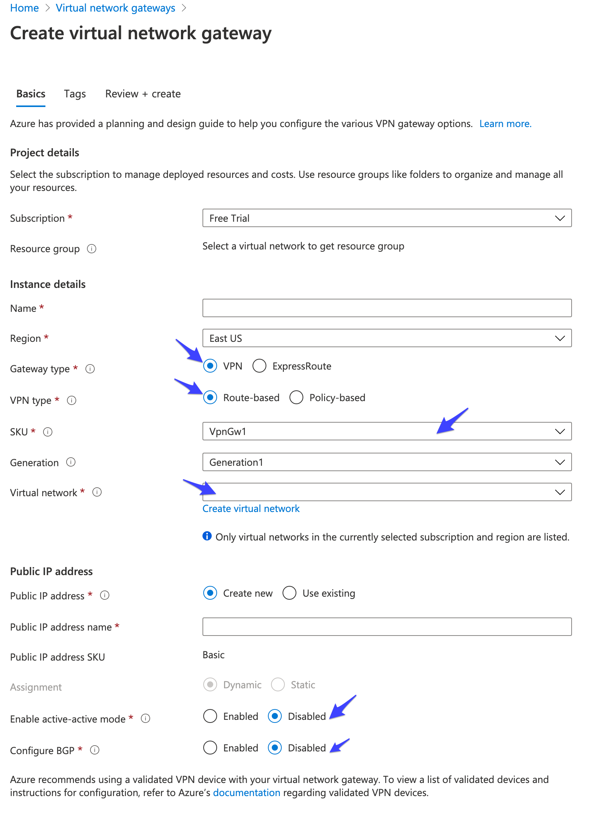
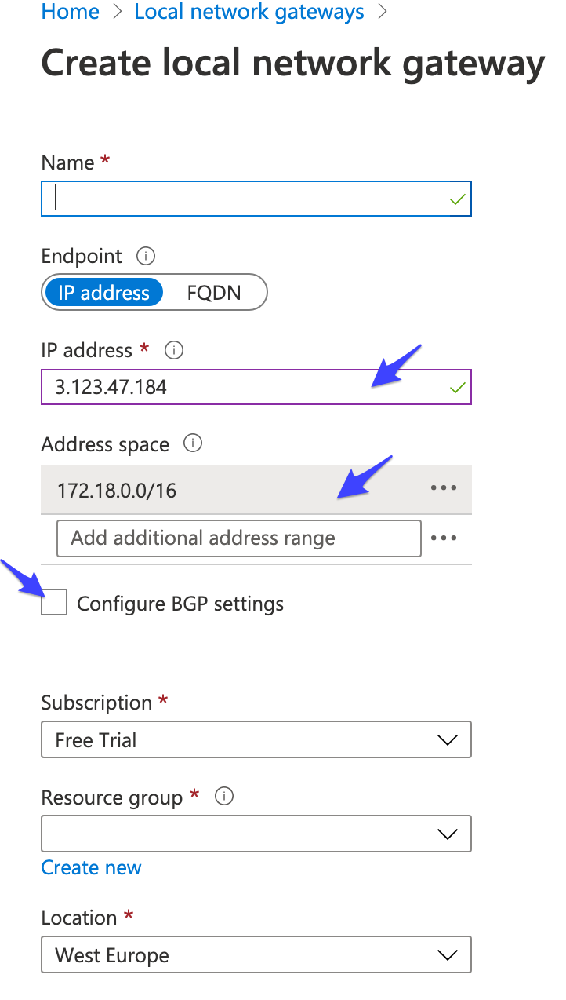
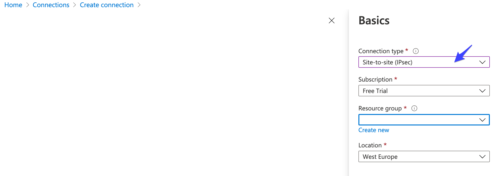
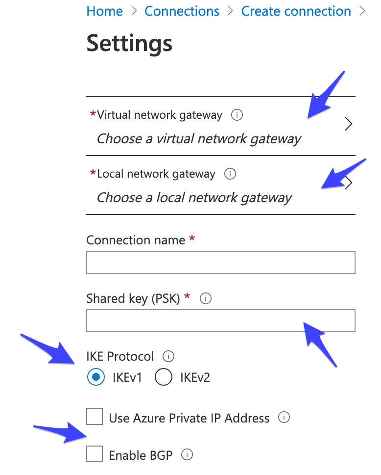
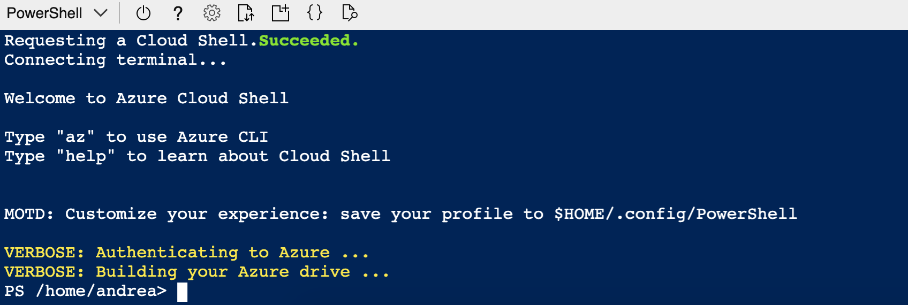
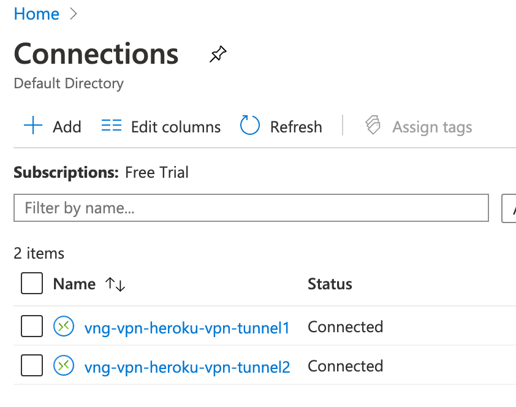

# Site to Site VPN between Microsoft Azure and Heroku
## DISCLAIMER
The author of this article makes any warranties about the completeness, reliability and accuracy of this information. **Any action you take upon the information of this website is strictly at your own risk**, and the author will not be liable for any losses and damages in connection with the use of the website and the information provided. **None of the items included in this repository form a part of the Heroku Services.**

## Setup procedure
Heroku [Private Space VPN connections](private-space-vpn-connection) can be used with [Azure VPN](https://docs.microsoft.com/en-us/azure/vpn-gateway/vpn-gateway-howto-site-to-site-resource-manager-portal), Azure's managed VPN feature. This makes it easy to establish a secure site-to-site VPN connection between your Private Space and Azure infrastructure.

You can connect your Private Space with Azure manually, or use Power Shell or Terraform to automate either a portion or the whole configuration steps.



1. If you already have a Heroku Private Space check that your Azure Virtual Network's internal CIDR range doesn't conflict with that of your space (typically `10.0.0.0/16` or `172.17.0.0/16`). If you're creating your Heroku Private Space and Azure Virtual Network from scratch make sure their respective CIDR ranges don’t overlap (e.g. Heroku CIDR is `172.18.0.0/16`, Azure CIDR is `10.2.0.0/16`).
2. Create an **Azure Virtual Network Gateway** using the following settings:
    - **Gateway type**: VPN
    - **VPN type**: Route-based
    - **SKU**: select only one of the SKUs that supports IKEv1 connections (e.g. `VpnGw1`). As per this [FAQ]( https://docs.microsoft.com/en-us/azure/vpn-gateway/vpn-gateway-vpn-faq#how-do-i-create-connections-with-ikev1-or-ikev2-protocol-type) *"IKEv1 connections can be created on all RouteBased VPN type SKUs, except the Basic SKU, Standard SKU, and other legacy SKUs."*
    - **Virtual Network**: select your Azure Virtual Network. Once selected a subnet (GatewaySubnet) is automatically configured for the virtual network.
    - **Enable active-active mode**: Disabled
    - **Configure BGP**: Disabled
    
    <p align="center">
    
    </p>
    

3. Once the the Network Gateway is created, note its public IP (e.g. `20.67.80.37`) and use it, along with the Azure CIDR, to provision the Heroku VPN connection as follows.

    ```term
    $ heroku spaces:vpn:connect --name vpn-connection-name --ip 20.67.80.37 --cidrs 10.2.0.0/16 --space space-name
    ```

4. Wait for provisioning to complete and print the connection info:

    ```term
    $ heroku spaces:vpn:wait  --name vpn-connection-name -s your-space
    Waiting for VPN Connection vpn-connection-name to allocate... done
    
    === vpn-connection-name VPN Tunnels
    VPN Tunnel  Customer Gateway  VPN Gateway     Pre-shared Key                    Routable Subnets  IKE Version
    ──────────  ────────────────  ──────────────  ────────────────────────────────  ────────────────  ───────────
    Tunnel 1    20.67.80.37       3.123.47.184    sY0sjBWR7YVeJI8x41Go5.ZRq.ohQOLu  172.18.0.0/16      1
    Tunnel 2    20.67.80.37       3.126.237.181   MmesiNxUH0OfcghtYrVSrTDhXj48qPmn  172.18.0.0/16      1
    ```

5. When provisioning is complete, get the public IPs for the Heroku VPN gateway, as well as the pre-shared IKEv1 keys.
6. Use the above information to create two **Azure Local Network Gateway**, one for each of the available Tunnels: 
    - fill the **IP address** field with the **Heroku VPN Gateway** (e.g. `3.123.47.184`)
    - fill the **Address space** field with the **Heroku Routable Subnets** (e.g. `172.18.0.0/16`)
    - leave unchecked the **Configure BGP settings**

    <p align="center">
    
    </p>

7. Create two **Azure Virtual Network Gateway Connections** to link each Azure Local Network Gateway with the corresponding Heroku VPN Gateway, using the following settings:
    - **Connection type**: Site-to-Site(IPSec)
    - **Virtual network gateway**: select the Virtual Network Gateway created on step (2)
    - **Local network gateway**: select one of the Local Network Gateways created on step (6)
    - **Shared key (PSK)**: use one of the Pre-shared IKEv1 keys collected on step (4)
    - **IKE Protocol**: IKEv1
    - Leave unchecked both **Use Azure Private IP Address** and **Enable BGP**

    <p align="center">
    
    </p>

    <p align="center">
    
    </p>

8. Using the Azure Portal to create Azure Virtual Network Gateway Connections doesn't support specifying a non-default IPsec/IKE policy, and the default is not compatible with the [settings](https://help.heroku.com/8V5218AS/how-can-i-establish-connection-to-my-private-space-vpn) required by the Heroku VPN. For this reason it's necessary to use PowerShell to modify the policy. This is easily done using the Azure Portal Cloud Shell:

    <p align="center">
    
    </p>

    <p align="center">
    
    </p>
 
    From the Cloud Shell terminal, execute the following commands, replacing the Connection and Resource Group names used to create the Azure Virtual Network Gateway Connections on the previous step.

    ```php
    $ipsecPolicy = New-AzIpsecPolicy -SALifeTimeSeconds 3600 -IpsecEncryption "AES256" -IpsecIntegrity "SHA256" -IkeEncryption "AES256" -IkeIntegrity "SHA256" -DhGroup "DHGroup2" -PfsGroup "PFS2"

    $conn1 = Get-AzVirtualNetworkGatewayConnection -Name <Connection1 name> -ResourceGroupName <Connection1 Resource Group name>
    Set-AzVirtualNetworkGatewayConnection -VirtualNetworkGatewayConnection $conn1 -IpsecPolicies $ipsecPolicy

    $conn2 = Get-AzVirtualNetworkGatewayConnection -Name <Connection2 name> -ResourceGroupName <Connection2 Resource Group name>
    Set-AzVirtualNetworkGatewayConnection -VirtualNetworkGatewayConnection $conn2 -IpsecPolicies $ipsecPolicy
    ```
9. After a few minutes check that the VPN connections are ready both on Azure (the Connection status is Connected) and Heroku (the connection status is Active and the Tunnels are UP).

    <p align="center">
    
    </p>

    ```term
    $ heroku spaces:vpn:connections --space space-name
    === space-name VPN Connections
    Name                  Status  Tunnels
    ────────────────────  ──────  ───────
    vpn-connection-name   active   UP/UP
    ```
